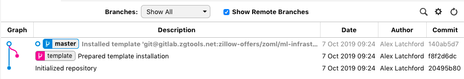
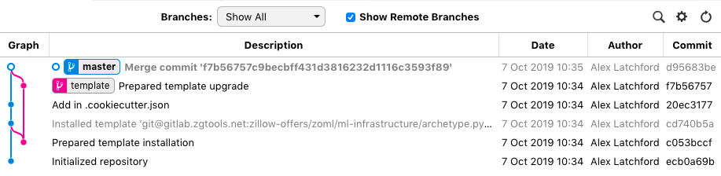

# milhoja

[](https://pypi.python.org/pypi/milhoja)

[](https://travis-ci.org/rmedaer/milhoja)

Battenberg is a tool built atop of Cookiecutter to keep Cookiecut projects in sync with their parent templates.
Under the hood, Battenberg relies on Git to manage the merging, diffing, and conflict resolution story. The first
goal of Battenberg is to provide an *upgrade* feature to Cookiecutter.

## Prerequistes

It is assumed that your cookiecutter template contains a `.cookiecutter.json` file at the root directory, or you can override it's location by
passing in `--context-file`. Please use the [`jsonify`](https://github.com/cookiecutter/cookiecutter/pull/791) Jinja2 extension to dump the
`cookiecutter` template context to `.cookiecutter.json`.

**Tip:** One problem `milhoja` has that as divergence between the cookiecutter template and the project itself increase as will the volume of
conflicts needed to be manually resolved for each upgrade merge. To minimize these it is often advisable to fit templates with a
`generate_example` boolean flag which will disable including any example code, instead replacing implementation with a [`pass`](https://docs.python.org/2.0/ref/pass.html) for example.

## Usage

Install a [Cookiecutter](https://github.com/audreyr/cookiecutter)
template on current directory:

    ```bash
    milhoja install <your cookiecutter>
    ```

Specify a target reference (branch, tag, commit):

    ```bash
    milhoja install -c v1.0.0 <your cookiecutter>
    ```

Show installed template:

    ```bash
    milhoja show
    ```

Install a [Cookiecutter](https://github.com/audreyr/cookiecutter) template on your existing Git repository:

    ```bash
    milhoja -C <your repo path> install <your cookiecutter>
    ```

Upgrade your repository with last version of template:

    ```bash
    milhoja -C <your repo path> upgrade
    ```

## High-level design

At a high level `milhoja` attempts to provide a continuous history between the upstream template project and the cookiecut project. It does this by maintaining a disjoint `template`
branch which `milhoja` attempts to keep in sync with the upstream template, it therefore will contain no project-specific changes beyond replacing the template values. Then changes
to the `template` are incorporated into the `master` and other branches via a `git merge --allow-unrelated-histories` command for each template update pulled in. This merge commit
should be used to resolve any conflicts between the upstream template and the specialized project.



*This shows the repo structure immediately after running a `milhoja install <template>` command*



*This shows the repo structure immediately after running a `milhoja upgrade` command on the previously installed project*

## Development

To get set up run:

    ```bash
    python3 -m venv env
    source env/bin/activate

    # Install in editable mode so you get the updates propagated.
    pip install -e .

    # If you want to be able to run tests & linting install via:
    pip install -e ".[dev]"
    ```

Then to actually perform any operations just use the `milhoja` command which should now be on your `$PATH`.

To run tests:

    ```bash
    pytest
    ```

To run linting:

    ```bash
    flake8 --config flake8.cfg milhoja
    ```

## FAQ

* Why are you using a new `.cookiecutter.json` pattern instead of using the [`replay` pattern](https://cookiecutter.readthedocs.io/en/latest/advanced/replay.html)?

    Frankly the implementation was quite convoluted to get the intentions of these features to align. With the `.cookiecutter.json` approach
    we're intended for template state to live at the project level instead of at the user level which the `replay` functionality defaults to.
    Overriding that behaviour, whilst possible was convoluted in the current `cookiecutter` API and would require upstream changes so instead
    we decided against trying to align these features.

## Credits

[Original code](https://github.com/rmedaer/milhoja) written by [Raphael Medaer](https://github.com/rmedaer) from an [original
idea](https://github.com/cookiecutter/cookiecutter/issues/784) of [Abdó Roig-Maranges](https://github.com/aroig).

## License

Free software: Apache Software License 2.0
